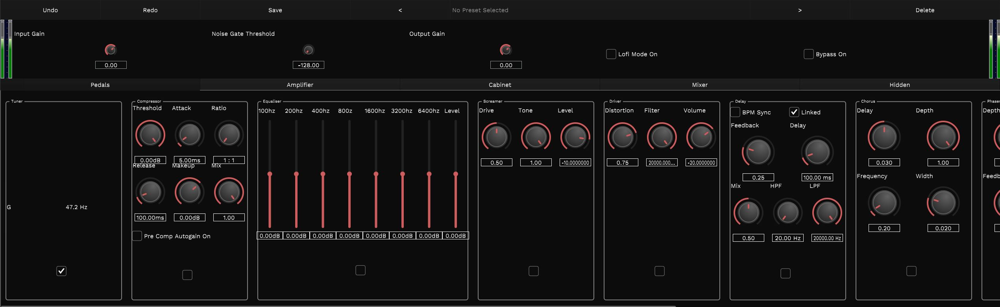

Supertonal is a work-in-progress guitar multi-effects processor featuring, in rough order:

- A tuner
- Gain staging
- Metering
- Noise gate
- Compression (multiple)
- A "screamer"
- A "mouse drive"
- Equilisation (multiple)
- Multi-stage wave-shaping
- Delay
- Chorus
- Phaser
- Flanger
- Bitcrusher
- Cabinet simulation with IR-loading
- Lo-fi mode
- Limiting

It is a work in progress, but I've made a strong effort to keep it portable and buildable with basic knowledge of JUCE. To get it working, simply:

```bash
git clone --recurse-submodules https://github.com/pauljonescodes/supertonal
```

Then you should be able to open up the `.jucer` file and work in your environment of choice.